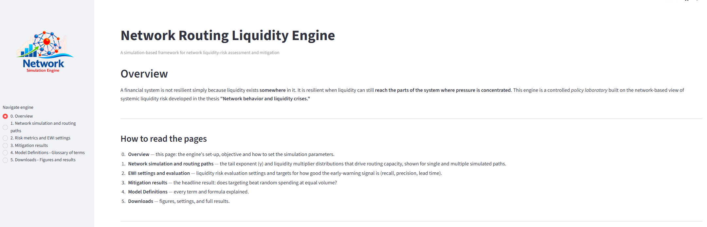
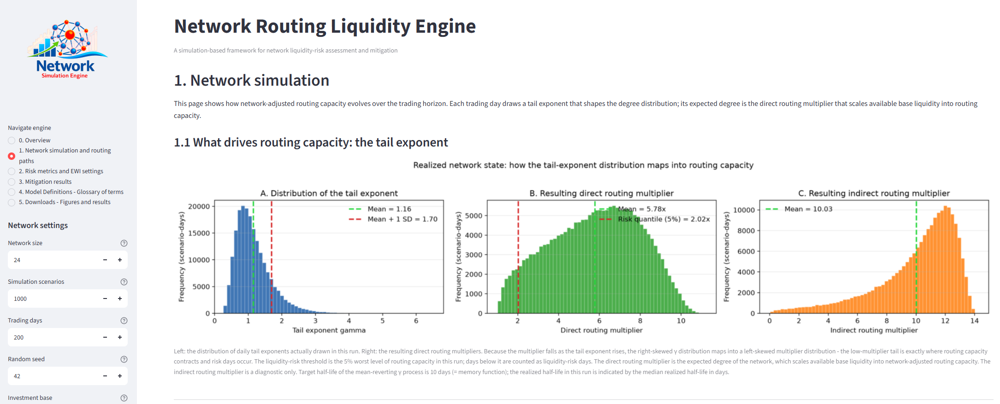
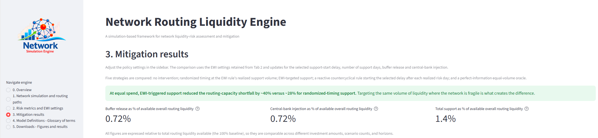
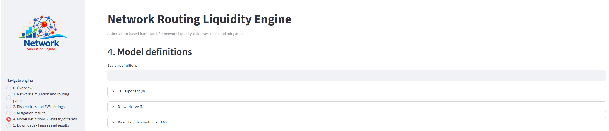

# Network Routing Liquidity Engine

> A reproducible Streamlit research application for examining how financial-network structure affects liquidity routing under stress and how alternative intervention strategies change simulated outcomes.


## Purpose

Financial resilience depends not only on how much liquidity institutions hold,
but also on whether the financial network can route that liquidity to the parts
of the system where pressure is concentrated.

The Network Routing Liquidity Engine is a controlled policy laboratory based on
the network perspective developed in the thesis *Network behavior and liquidity
crises*. It distinguishes between:

- **balance-sheet capacity**, the liquidity institutions can supply; and
- **routing capacity**, the ability of the network to transmit that liquidity
  through direct and indirect intermediation links.

The engine focuses on routing capacity. It does not forecast a particular crisis
or reconstruct an observed institution-level network. Instead, it provides a
transparent environment for studying how network structure, warning quality,
intervention timing, liquidity buffers, and central-bank support influence
simulated liquidity shortfalls.

## Key features

- **Mean-reverting network topology:** simulates a positive, time-varying tail
  exponent that controls the implied degree distribution.
- **Network-adjusted liquidity:** maps each simulated network state into direct
  and indirect routing multipliers.
- **Configurable liquidity risk:** identifies risk days from the lower tail of
  baseline direct routing capacity.
- **Performance-controlled EWI:** reports configured and realized recall,
  precision, lead time, and signal counts separately.
- **Two support channels:** combines dynamic buffer release and central-bank
  liquidity injection.
- **Five policy strategies:** compares no intervention, reactive
  countercyclical support, EWI-targeted support, randomized timing, and a
  perfect-information oracle.
- **Reproducible execution:** uses explicit configuration objects and fixed
  random seeds.
- **Auditable outputs:** exports figures, tables, settings, diagnostics, and the
  parameters used to generate the results.

## Application pages

0. **Overview** explains the policy question, model scope, and configuration.
1. **Network simulation and routing paths** presents simulated network states,
   multiplier distributions, and individual and ensemble paths.
2. **Risk metrics and EWI settings** reports baseline risk outcomes and the
   realized performance of the warning signal.
3. **Mitigation results** compares the five policy strategies.
4. **Model definitions** provides a glossary of the main concepts.
5. **Downloads** exports figures, settings, diagnostics, and result tables.

## Application walkthrough

A live version of the application is deployed at
[network-routing-liquidity-simulation-engine.streamlit.app](https://network-routing-liquidity-simulation-engine.streamlit.app/).
When `app.py` is run, a Streamlit application starts with a **navigation panel
on the left-hand side** listing the six application pages described above,
numbered 0–5. The same left-hand panel also hosts the **simulation input
parameters**, which are pre-populated with the default values used in the
Chapter 8 simulation of the thesis, so the deployed app reproduces the thesis
results out of the box and can then be re-parameterized for further
exploration. The screenshots below (top of each page) can be used to verify
that a local or redeployed instance is set up correctly.

### 0. Overview

Explains the policy question addressed by the engine, the scope of the model, and how to read the remaining pages
(0. Overview, 1. Network simulation and routing paths, 2. EWI settings and evaluation, 
3. Mitigation results, 4. Model definitions, 5. Downloads).



### 1. Network simulation and routing paths

Takes the network simulation parameters entered in the left-hand panel
(network size, simulation scenarios, trading days, random seed, investment
base) and renders the resulting distribution of the tail exponent (γ) together
with the direct and indirect routing multipliers it implies, shown both for a
single realized network state and across all simulated scenario-days.




### 2. Risk metrics and EWI settings

Takes the early-warning indicator (EWI) settings (target recall, target
precision, fixed EWI lead time) entered in the left-hand panel and reports the
baseline liquidity-risk evaluation metrics (baseline risk-scenario rate,
baseline risk-day rate, baseline relative shortfall) together with the
configured versus realized recall and precision of the warning signal.


### 3. Mitigation results

Compares the simulated outcomes of the five policy strategies (no
intervention, reactive countercyclical support, EWI-targeted support,
randomized timing, and the perfect-information oracle) for the parameter
configuration selected in the left-hand panel, reporting both the
routing-capacity shortfall reduction (e.g., EWI-triggered support versus
randomized-timing support at equal spend) and the support volume used by each
strategy (buffer release, central-bank injection, and total support as a
percentage of available routing liquidity).



### 4. Model definitions

Provides a searchable glossary of all model concepts and formulas (tail
exponent, network size, direct/indirect liquidity multipliers, network-adjusted
routing capacity, etc.) for easy reference while navigating the other pages.




### 5. Downloads

Lets the user export the figures, settings, diagnostics, and result tables
generated by the current configuration (download all PNG figures, Excel
results, comparison PNG, and comparison CSV).

### Exported figures and thesis cross-references

The files produced from the **Downloads** page correspond directly to figures
reported in Chapter 8 of the thesis, which allows any exported output to be
audited against the manuscript:

| Export file | Thesis figure |
|---|---|
| `01_selected_scenario` | Figure 8.2 |
| `02_all_simulations` | Figure 8.3 |
| `03_mitigation_comparison` | Figure 8.4 |
| `04_network_state_distributions` | Figure 8.1 |

## Policy comparison

The comparison is designed to separate intervention timing from intervention
volume:

- **No intervention** provides the baseline.
- **Reactive countercyclical intervention** responds after a realized risk day.
- **EWI-targeted intervention** responds to an imperfect advance-warning signal.
- **Randomized timing** reallocates the EWI strategy's realized support-day
  budget to random dates.
- **Perfect-information oracle** allocates the same support-day budget to the
  weakest baseline observations using information that would not be available
  in practice.

Randomized timing and the oracle are equal-volume timing controls. The reactive
countercyclical strategy is event-driven and may therefore use a different
realized support volume. The comparison reports both risk outcomes and support
volume so these differences remain visible.

For the formal model, equations, parameter definitions, and implementation
logic, see [`MODEL_DESCRIPTION.md`](MODEL_DESCRIPTION.md).

## Installation

Create a virtual environment:

```bash
python -m venv .venv
```

Activate it on Windows:

```powershell
.venv\Scripts\activate
```

Activate it on macOS or Linux:

```bash
source .venv/bin/activate
```

Install the dependencies:

```bash
python -m pip install -r requirements.txt
```

Python 3.10 or later is recommended.

## Quick start

From the repository root, run:

```bash
streamlit run app.py
```

## S = 1 integration smoke test

The repository uses a single-scenario integration smoke test instead of a
separate test suite. It checks that the smallest supported scenario dimension
passes through the simulation, EWI, policy, randomized benchmark, and
five-strategy comparison pipeline without runtime or shape errors.

Run it with pytest:

```bash
python -m pytest examples/test_s1_default.py -v
```

Run it as a standalone reproducibility example:

```bash
python -m examples.test_s1_default
```

The standalone run creates `s1_smoke_test_comparison.csv`. The export contains
one row per strategy and includes the simulation, EWI, policy, benchmark, and
realized-run parameters used to generate the results.

See [`examples/README_S1_DEFAULT.md`](examples/README_S1_DEFAULT.md) for the
scope, execution instructions, exported fields, and interpretation of the
smoke test.

## Repository structure

| Path | Purpose |
|---|---|
| `app.py` | Streamlit interface and cached computational pipeline. |
| `src/simulation.py` | Mean-reverting topology process, routing paths, threshold, and event mask. |
| `src/topology.py` | Degree distribution, network moments, and multiplier grids. |
| `src/metrics.py` | Liquidity-risk rates and shortfall measures. |
| `src/ewi.py` | Performance-controlled warning-signal emulator and diagnostics. |
| `src/policy.py` | Activation masks, support application, randomized benchmark, and oracle. |
| `src/comparison.py` | Five-strategy result normalization, comparison table, figure, and export helpers. |
| `src/plotting.py` | Network-state and routing-capacity figures. |
| `src/definitions.py` | Application glossary. |
| `assets/NetworkSimulationEngineLogo` | Logo. |
| `assets/screenshots/` | README walkthrough screenshots. |
| `examples/test_s1_default.py` | S = 1 integration smoke test and auditable CSV export. |
| `examples/README_S1_DEFAULT.md` | Smoke-test instructions and interpretation. |
| `MODEL_DESCRIPTION.md` | Formal model, equations, assumptions, and implementation sequence. |
| `requirements.txt` | Python dependencies. |
| `CITATION.cff` | Citation metadata. |
| `LICENSE` | Apache License 2.0. |

## Scope and limitations

The engine is a reduced-form policy laboratory for network-routing effects. It
does not estimate an institution-level counterparty graph or model strategic
behavior, balance-sheet adjustment, market prices, margins, collateral calls,
or crisis probabilities. The EWI is a controlled signal emulator rather than a
fitted forecasting model. The oracle is an infeasible upper benchmark. Results
should therefore be interpreted comparatively and conditional on the selected
assumptions.

## Reproducibility

- All stochastic components use explicit seeds.
- Model settings are stored in configuration objects.
- Dependencies are recorded in `requirements.txt`.
- The S = 1 smoke test exercises the integrated computational pipeline.
- The smoke-test CSV records the settings associated with every strategy row.
- Application figures, diagnostics, settings, and tables can be exported.

## Citation

Use the metadata in [`CITATION.cff`](CITATION.cff).

## License

Apache License 2.0. See [`LICENSE`](LICENSE).

## Contributing

Issues and pull requests are welcome. Before submitting a change, run:

```bash
python -m pytest examples/test_s1_default.py -v
```
