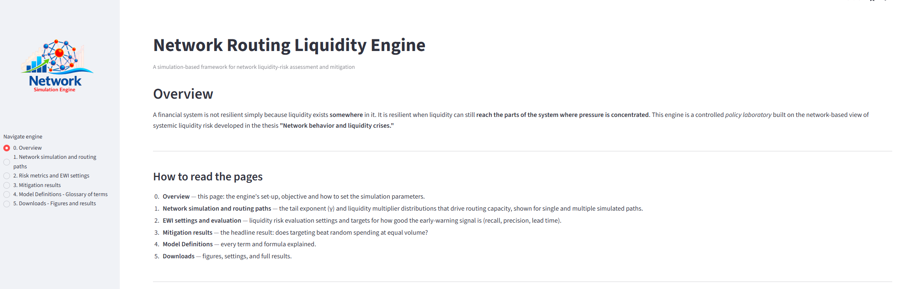
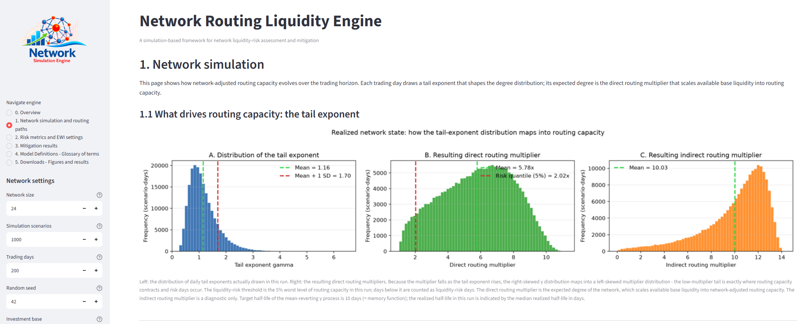
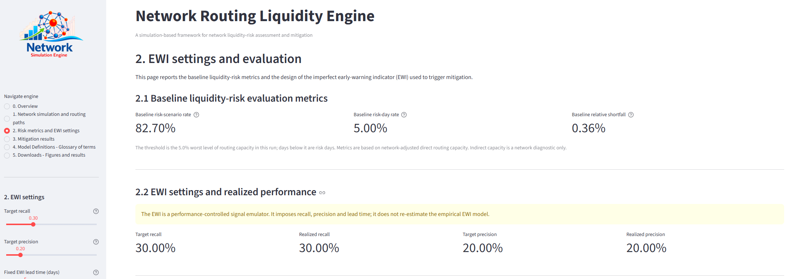
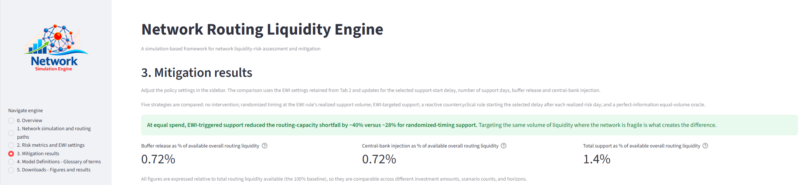
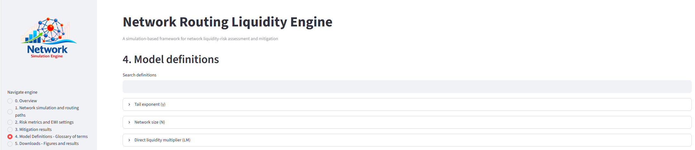

# Network Routing Liquidity Simulation Engine

> A reproducible Streamlit research application for examining how financial-network structure affects liquidity routing under stress and how alternative intervention strategies change simulated outcomes.

[](https://www.python.org/)
[](https://streamlit.io/)
[](LICENSE)
[](#scope-and-limitations)

**Live application:** [network-routing-liquidity-simulation-engine.streamlit.app](https://network-routing-liquidity-simulation-engine.streamlit.app/)

## Contents

- [Purpose](#purpose)
- [Key features](#key-features)
- [Quick start](#quick-start)
- [Verify the installation (S = 1 smoke test)](#verify-the-installation-s--1-smoke-test)
- [Default parameters](#default-parameters)
- [Application pages](#application-pages)
- [Policy comparison](#policy-comparison)
- [Repository structure](#repository-structure)
- [Scope and limitations](#scope-and-limitations)
- [Reproducibility](#reproducibility)
- [Citation](#citation) · [License](#license) · [Contributing](#contributing)

## Purpose

Financial resilience depends not only on how much liquidity institutions hold,
but also on whether the financial network can route that liquidity to the parts
of the system where pressure is concentrated.

The Network Routing Liquidity Simulation Engine is a controlled policy laboratory based on
the network perspective developed in the thesis *Network behavior and liquidity
crises*. It distinguishes between:

- **balance-sheet capacity**, the liquidity institutions can supply; and
- **routing capacity**, the ability of the network to transmit that liquidity
  through direct and indirect intermediation links.

The engine focuses on routing capacity. It does not forecast a particular crisis
or reconstruct an observed institution-level network. Instead, it provides a
transparent environment for studying how network structure, warning quality,
intervention timing, liquidity buffers, and central-bank support influence
simulated liquidity shortfalls.

## Key features

- **Mean-reverting network topology:** simulates a positive, time-varying tail
  exponent that controls the implied degree distribution.
- **Network-adjusted liquidity:** maps each simulated network state into direct
  and indirect routing multipliers.
- **Configurable liquidity risk:** identifies risk days from the lower tail of
  baseline direct routing capacity.
- **Performance-controlled EWI:** reports configured and realized recall,
  precision, lead time, and signal counts separately.
- **Two support channels:** combines dynamic buffer release and central-bank
  liquidity injection.
- **Five policy strategies:** compares no intervention, reactive
  countercyclical support, EWI-targeted support, randomized timing, and a
  perfect-information oracle.
- **Reproducible execution:** uses explicit configuration objects and fixed
  random seeds.
- **Auditable outputs:** exports figures, tables, settings, diagnostics, and the
  parameters used to generate the results.

## Quick start

Requires Python 3.10 or later. Run all commands from the repository root.

```bash
# 1. Create and activate a virtual environment
python -m venv .venv
source .venv/bin/activate          # macOS / Linux
.venv\Scripts\activate             # Windows (PowerShell)

# 2. Install dependencies
python -m pip install -r requirements.txt

# 3. Launch the application
streamlit run app.py
```

The application opens in your browser (by default at `http://localhost:8501`).
Its default inputs reproduce the Chapter 8 simulation of the thesis.

## Verify the installation (S = 1 smoke test)

The repository uses a single-scenario (`S = 1`) integration smoke test instead
of a separate test suite. It checks that the smallest supported scenario
dimension passes through the simulation, EWI, policy, randomized benchmark, and
five-strategy comparison pipeline without runtime or shape errors.

| Step | Command | Expected result |
|---|---|---|
| Run the test | `python -m pytest examples/test_s1_default.py -v` | `1 passed` (a few seconds) |
| Create the audit CSV | `python -m examples.test_s1_default` | `S=1 pipeline smoke test passed.` and `s1_smoke_test_comparison.csv` in the working directory |

The CSV contains one row per strategy, with the simulation, EWI, policy,
benchmark, and realized-run parameters repeated on every row. It is an audit
artefact: the pytest assertions, not the CSV, determine whether the test
passes. The test checks shapes, required result fields, finite values, and the
five-row comparison table. It does **not** validate economic calibration,
statistical inference, or Monte Carlo convergence.

See [`examples/README_S1_DEFAULT.md`](examples/README_S1_DEFAULT.md) for the
exported fields, interpretation, and common failures.

## Default parameters

Defaults come from the configuration objects in `src/` and are the values used
in the Chapter 8 simulation. See [`MODEL_DESCRIPTION.md`](MODEL_DESCRIPTION.md)
for definitions.

| Group | Parameter | Default |
|---|---|---|
| Simulation | Network size (`n_nodes`) | 24 |
| | Scenarios | 1,000 (1 in the smoke test) |
| | Trading days | 200 |
| | Investment base | 100 |
| | Normal liquidity buffer | 40 % |
| | Risk quantile (`liquidity_risk_q`) | 5 % |
| | Tail exponent mean (μ) / s.d. (σ) | 1.1573 / 0.5381 |
| | Half-life of topology shocks | 10 trading days |
| | Random seed | 42 |
| EWI | Target recall / precision | 0.30 / 0.20 |
| | Lead time | 5 trading days |
| Policy | Buffer release / central-bank injection | 5 % / 5 % |
| | Support days / start delay | 10 / 5 |
| Benchmark (smoke test) | Replications / seed | 1,000 / simulation seed + 42 |

## Application pages

The left-hand panel lists the six pages (numbered 0–5) and hosts the input
parameters. The screenshots show the top of each page and can be used to check
that a local or redeployed instance is set up correctly.

### 0. Overview

Explains the policy question, the model scope, and how to read the remaining
pages.



### 1. Network simulation and routing paths

Takes the network simulation inputs (network size, scenarios, trading days,
random seed, investment base) and shows the distribution of the tail exponent
(γ) and the direct and indirect routing multipliers it implies, for a single
realized network state and across all simulated scenario-days.



### 2. EWI settings and evaluation

Takes the early-warning indicator (EWI) inputs (target recall, target precision,
fixed lead time) and reports the baseline liquidity-risk metrics (risk-scenario
rate, risk-day rate, relative shortfall) together with the configured versus
realized recall and precision of the warning signal.



### 3. Mitigation results

Compares the five policy strategies for the selected configuration. It reports
the routing-capacity shortfall reduction (for example, EWI-triggered versus
randomized-timing support at equal spend) and the support volume each strategy
uses (buffer release, central-bank injection, and total support as a percentage
of available routing liquidity).



### 4. Model definitions

A searchable glossary of the model concepts and formulas (tail exponent,
network size, direct and indirect liquidity multipliers, network-adjusted
routing capacity, and others).



### 5. Downloads

Exports the figures (PNG, zipped) and the settings, diagnostics, and result
tables (Excel) for the current configuration.

## Exported figures and cross-references
The four figures exported from the Downloads page are Figures 1–4 of the [working paper on SSRN](https://doi.org/10.2139/ssrn.7570458) with tittle: *Network Simulation Engine*, which is the citable reference for this repository. They also correspond to Chapter 8 of the thesis Network behavior and liquidity crises. The thesis has not been published yet, so the working paper is currently the only public source of these figures. Thesis figure numbers are provisional and may change before the final version.

| Export file | SSRN Working paper figure | Thesis figure |
|---|---|---|
| `Figure_1_multiplier_distribution_figure.png` | Figure 1 | Figure 8.1 |
| `Figure_2_routing_paths_figure.png` | Figure 2 | Figure 8.2 |
| `Figure_3_all_simulation_paths.png` | Figure 3 | Figure 8.3 |
| `Figure_4_policy_comparison.png` | Figure 4 | Figure 8.4 |

## Policy comparison

The comparison separates intervention timing from intervention volume:

| Strategy | Rule | Volume |
|---|---|---|
| No intervention | Baseline | None |
| Reactive countercyclical | Responds after a realized risk day | Event-driven; may differ |
| EWI-targeted | Responds to an imperfect advance-warning signal | Set by the signal |
| Randomized timing | Reallocates the EWI strategy's support-day budget to random dates | Equal to EWI |
| Perfect-information oracle | Allocates the same budget to the weakest baseline observations (infeasible in practice) | Equal to EWI |

Randomized timing and the oracle are equal-volume timing controls. The
reactive strategy may use a different realized support volume, so the
comparison reports risk outcomes and support volume side by side.

## Repository structure

| Path | Purpose |
|---|---|
| `app.py` | Streamlit interface and cached computational pipeline. |
| `src/simulation.py` | Mean-reverting topology process, routing paths, threshold, and event mask. |
| `src/topology.py` | Degree distribution, network moments, and multiplier grids. |
| `src/metrics.py` | Liquidity-risk rates and shortfall measures. |
| `src/ewi.py` | Performance-controlled warning-signal emulator and diagnostics. |
| `src/policy.py` | Activation masks, support application, randomized benchmark, and oracle. |
| `src/comparison.py` | Five-strategy comparison table, figure, and export helpers. |
| `src/plotting.py` | Network-state and routing-capacity figures. |
| `src/definitions.py` | Application glossary. |
| `assets/` | Logo (`NetworkSimulationEngineLogo.png`) and README screenshots (`panel-*.png`). |
| `examples/test_s1_default.py` | S = 1 integration smoke test and audit CSV export. |
| `examples/README_S1_DEFAULT.md` | Smoke-test instructions and interpretation. |
| `MODEL_DESCRIPTION.md` | Formal model, equations, assumptions, and implementation sequence. |
| `requirements.txt` | Python dependencies. |
| `CITATION.cff` | Citation metadata. |
| `LICENSE` | Apache License 2.0. |

## Scope and limitations

The engine is a reduced-form policy laboratory for network-routing effects. It
does not estimate an institution-level counterparty graph or model strategic
behavior, balance-sheet adjustment, market prices, margins, collateral calls,
or crisis probabilities. The EWI is a controlled signal emulator rather than a
fitted forecasting model. The oracle is an infeasible upper benchmark. Results
should therefore be interpreted comparatively and conditional on the selected
assumptions.

## Reproducibility

- All stochastic components use explicit seeds; the randomized benchmark uses a
  separately recorded seed derived from the simulation seed.
- Model settings are stored in configuration objects.
- Dependencies are listed in `requirements.txt`.
- The S = 1 smoke test exercises the integrated pipeline, and the audit CSV
  records the settings and realized diagnostics for every strategy row.
- Application figures, diagnostics, settings, and tables can be exported.

The smoke test was run successfully with Python 3.12.14, streamlit 1.53.1,
numpy 1.26.4, pandas 2.2.2, matplotlib 3.8.4, openpyxl 3.1.5, and pytest 9.1.1.

## Citation

Use the metadata in [`CITATION.cff`](CITATION.cff).

## License

Apache License 2.0. See [`LICENSE`](LICENSE).

## Contributing

Issues and pull requests are welcome. Before submitting a change, run:

```bash
python -m pytest examples/test_s1_default.py -v
```
